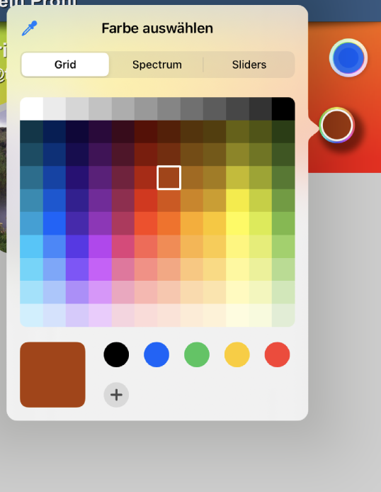

# ti.colorwheel (NEW)

## Description

ColorWheel Control (UIColorWell and UIColorPickerViewController) for iOS (Titanium Module) 

min Ti SDK 9.3.2
min iOS 14.x





## Usage

```javascript
	var colorPickerModule = require('ti.colorwheel');

	// customButtonView - for when systemButton:false
	var colorWheelViewButton = Ti.UI.createView({
		top:3,
		bottom:3,
		left:3,
		right:3,
		width:44,
		height:44,
		borderRadius:22,
		borderColor:'#CCFFFFFF',
		borderWidth:4,
		opacity:1.0,
		backgroundImage:'/images/colorwheel.jpg',
		viewShadowColor: '#AA000000',
		viewShadowOffset: {
			x: 2,
			y: 2
		},
		viewShadowRadius: 4,
	});


	var colorWheelView = colorPickerModule.createView({
		width:Ti.UI.SIZE, //only useable in combination with systemButton:false - if true, the colorWheel will be sized by iOS (default size from UIKit) - if false the view will react to width / height
		height:Ti.UI.SIZE, //only useable in combination with systemButton:false - if true, the colorWheel will be sized by iOS (default size from UIKit) - if false the view will react to width / height
		customView:colorWheelViewButton,
		systemButton:false, // if false, the system colorButton is not visible, you need to set a customView with the "customView" property
		// this colorwheelView including alls childviews (of customView) -> if systemButton = false, will be disabeld (no touch events fired) when the colorpickerController is open!
		supportsAlpha:false,
		// set a preselected Color - also when using systemButton:true and selectedColor is not set, the property will be set when the user selects a color in the pickerController
		//  selectedColor:'blue',
		title:'Select your color!!', // title of colorpicker-modal-window
		tintColor:'red',
		// if you want a larger ColorWheel-Button (makes sense for systemButton:true because the colorWheelControl has iOS fixed sizes )
		transform:Titanium.UI.createMatrix2D({
			scale:(2.0)
		}),
		animated:true,
		// ------------------------------------------------------
		// non pickerview-modalview or colorwheel control related
		bottom:30, // normal view properties
		right:30,
		//borderRadius:22, // if systemButton = true -> the View will be auto sized to w:44 and h:44 -> therefore the borderRadius for a circled rounded view will be 22 -> in case you use viewShadow.....
		backgroundColor:'transparent',
		// viewShadowColor: '#AA000000',
		// viewShadowOffset: {
		// 	x: 1,
		// 	y: 2
		// },
		// viewShadowRadius: 3,
	});


	// Example how to implement "autoClosing" on Titanium side
	// with "selection" event and a timeout that runs when the user
	// did not select a color (per example with the sliders in the controller)
	// after the timeout - here 0.55 seconds
	// autoClose property is not existing in the colorPickerController
	// for now.....
	var colorWheelViewAutoCloseTimeout = null;

	colorWheelView.addEventListener('selection', function(e) {
		// selection event returns the selected color
		// in event.color
		console.log("colorWheelView selection: "+e.color);

		if (colorWheelViewButton){
			colorWheelViewButton.backgroundImage = null;
			colorWheelViewButton.backgroundImage = undefined;
			colorWheelViewButton.backgroundColor = e.color;
		}

		if (colorWheelViewAutoCloseTimeout){
			clearTimeout(colorWheelViewAutoCloseTimeout);
			colorWheelViewAutoCloseTimeout = null;
		}
		colorWheelViewAutoCloseTimeout = setTimeout(function(){

			console.log("colorWheelViewAutoCloseTimeout ");

			// if animated:true it will fadeout and then automaticly removed from the parentView when has a containerViewForController in .showView() and returnView:true, if NOT the colorPickerController (modal) is dismissed
			colorWheelView.hidePicker({
				animated:true
			});
	
		},550);
	});


	colorWheelView.addEventListener('click', function(e) {
		var colorPickerControllerView = colorWheelView.showPicker({
			returnView:false,  
			// if true showPicker returns the colorPickerControllerView as child of the containerViewForController property - which needs a view!!!
			// if false it opens as modal on iPhone or as popover on iPad
			containerViewForController: Ti.UI.createView({
				left:0,
				right:0,
				top:200,
				bottom:100,
				width:Ti.UI.SIZE,
				backgroundColor:'blue',
				height:Ti.UI.SIZE
			})
		});

		if (colorPickerControllerView != null){
			self.add(colorPickerControllerView);	
		}
	});

	colorWheelView.addEventListener('hide', function(e) {
		console.log("colorWheelView hide: ");

		// no event value!!! just the event
		// will send when the colorWheelView is closed by .hidePicker() and has a containerViewForController in .showView()
		// and returnView:true -- it´s an additional event that extend the cancel and closed events
		
	});


	colorWheelView.addEventListener('closed', function(e) {
		console.log("colorWheelView closed: ");

		// no event value!!! just the event
		// will send every time (on manual dismiss or closebutton)
		// will be fired after 0.2 seconds - cancel event if controller view is dismissed by user with close button or dragged to dismiss is fired first!

		// if animated:true it will fadeout and then automaticly removed from the parentView when has a containerViewForController in .showView() and returnView:true, if NOT the colorPickerController (modal) is dismissed
		colorWheelView.hidePicker({
			animated:true 
		});
	});

	colorWheelView.addEventListener('cancel', function(e) {
		console.log("colorWheelView cancel: ");

		// no event value!!! just the event
		// will send when predefined color is equal selected color
		// or when no color (also when no predefined color set) is selected
		// and the user click the close button or manually dismiss the controller
		// after "cancel" also "closed" will be fired!
		
	});

	YOUR_PARENT_VIEW.add(colorWheelView);
```
