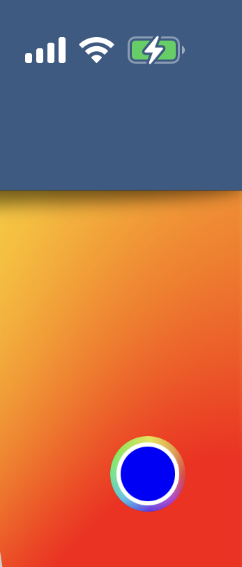
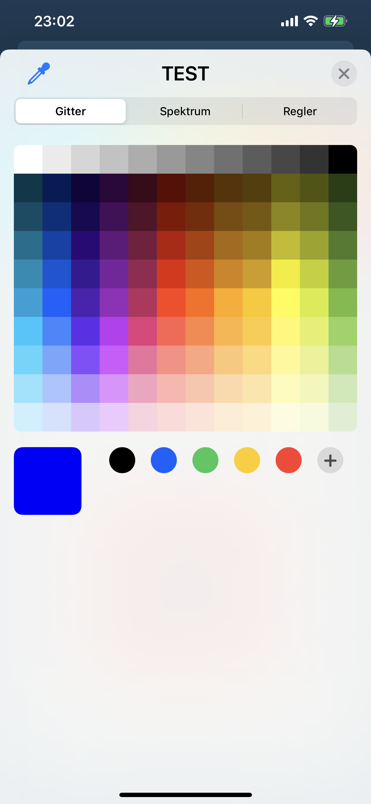

# ti.colorwheel (NEW)

## Description

ColorWheel Control (UIColorWell and UIColorPickerViewController) for iOS (Titanium Module) 

min Ti SDK 9.3.2
min iOS 14.x

## Usage

	var colorPickerModule = require('ti.colorwheel');

	var colorWheelView = colorPickerModule.createView({
        width:50, //default wheel size!!!
        height:50, //default wheel size!!!
        supportsAlpha:false,
        color:'blue', // set a preselected Color
        title:'TEST', // title of Controller
        animated:true,
        backgroundColor:'transparent',
    });
    colorWheelView.addEventListener('selection', function(e) {
		// hex-value of selected color
        console.log("colorWheelView selection: "+e.color);
    });
    colorWheelView.addEventListener('closed', function(e) {
        // no event value!!! just the event
        // will send every time (on manual dismiss or closebutton)
        console.log("colorWheelView closed");
    });
    colorWheelView.addEventListener('cancel', function(e) {
        // no event value!!! just the event
        // will send when predefined color is equal selected color
        // or when no color (also when no predefined color set) is selected
        // and the user click the close button or manually dismiss the controller
        // after "cancel" also "closed" will be fired!
        console.log("colorWheelView cancelled");
    });
    colorWheelView.addEventListener('click', function(e) {
        colorWheelView.showPicker();
    });

	YOUR_PARENT_VIEW.add(colorWheelView);
